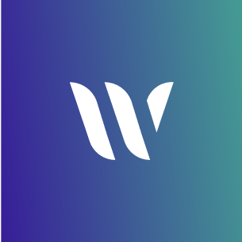

<!--
SPDX-FileCopyrightText: 2025 2025 INDUSTRIA DE DISEÑO TEXTIL S.A. (INDITEX S.A.)

SPDX-License-Identifier: Apache-2.0
-->

<!-- Improved compatibility of back to top link: See: https://github.com/othneildrew/Best-README-Template/pull/73 -->

<!--
*** Thanks for checking out the Best-README-Template. If you have a suggestion
*** that would make this better, please fork the repo and create a pull request
*** or simply open an issue with the tag "enhancement".
*** Don't forget to give the project a star!
*** Thanks again! Now go create something AMAZING! :D
-->

<!-- PROJECT SHIELDS -->
<!--
*** I'm using markdown "reference style" links for readability.
*** Reference links are enclosed in brackets [ ] instead of parentheses ( ).
*** See the bottom of this document for the declaration of the reference variables
*** for contributors-url, forks-url, etc. This is an optional, concise syntax you may use.
*** https://www.markdownguide.org/basic-syntax/#reference-style-links
-->

[![Contributors][contributors-shield]][contributors-url]
[![Forks][forks-shield]][forks-url]
[![Stargazers][stars-shield]][stars-url]
[![Issues][issues-shield]][issues-url]
[![project_license][license-shield]][license-url]

<!-- PROJECT LOGO -->
 

  

<h3 align="center">Weave.js Frontend UI Showcase</h3>

  

    Build online whiteboard applications like Excalidraw, Miro, Canva, or Figma!
     
    <a href="https://github.com/InditexTech/weavejs-frontend"><strong>Explore the docs »</strong></a>
     
     
    <a href="https://github.com/InditexTech/weavejs-frontend">View Demo</a>
    &middot;
    <a href="https://github.com/InditexTech/weavejs-frontend/issues/new?labels=bug&template=bug-report.md">Report Bug</a>
    &middot;
    <a href="https://github.com/InditexTech/weavejs-frontend/issues/new?labels=enhancement&template=feature-request.md">Request Feature</a>
  

<!-- TABLE OF CONTENTS -->

  
Table of Contents

  <ol>
    <li>
      <a href="#about-the-project">About The Project</a>
      <ul>
        <li><a href="#built-with">Built With</a></li>
        <li><a href="#related-repositories">Related repositories</a></li>
      </ul>
    </li>
    <li>
      <a href="#getting-started">Getting Started</a>
      <ul>
        <li><a href="#prerequisites">Prerequisites</a></li>
        <li><a href="#installation">Installation</a></li>
      </ul>
    </li>
    <li><a href="#roadmap">Roadmap</a></li>
    <li><a href="#contributing">Contributing</a></li>
    <li><a href="#license">License</a></li>
    <li><a href="#contact">Contact</a></li>
  </ol>

<!-- ABOUT THE PROJECT -->

## About The Project

[![Weave.js Screen Shot][product-screenshot]](images/screenshot.png)

Weave.js is a powerful headless framework for building end-to-end collaborative whiteboard applications. Aimed at developers, it provides all the building blocks and plugins to develop visual collaborative canvas, as well as it handles user interactions in real time, so that changes in the visual canvas can be shared among multi users in real time.

It provides robust synchronization based on [Yjs][https://yjs.dev/] and [SyncedStore][https://syncedstore.org/docs/] as well as an extensible API to streamline the development of interactive, collaborative applications.

(<a href="#readme-top">back to top</a>)

### Built With

- [Konva][https://konvajs.org/]
- [Yjs][https://yjs.dev/]
- [SyncedStore][https://syncedstore.org/docs/]

(<a href="#readme-top">back to top</a>)

### Related repositories

- [Weave.js][https://github.com/InditexTech/weavejs]
- [Weave.js backend][https://github.com/InditexTech/weavejs-backend]

(<a href="#readme-top">back to top</a>)

<!-- GETTING STARTED -->

## Getting Started

Follow the [Quickstart documentation][docs-quick-start-url#frontend] to create your Weave.js project frontend and startup a sample application running on your local development environment.

Follow the [Weave.js documentation][docs-url] for details on setup instructions, usage guidelines, architecture details, and more.

### Prerequisites

- macOS, Windows (WSL), or Linux.
- Node.js 18.18.0 or later.
- React 18.2.0 or less than 19.x.
- A Weave.js backend server created

(<a href="#readme-top">back to top</a>)

<!-- ROADMAP -->

## Roadmap

Check out [Weave.js roadmap][docs-roadmap-url] for details on planned work and the features that will come next.

(<a href="#readme-top">back to top</a>)

<!-- CONTRIBUTING -->

## Contributing

Contributions are welcome! Please see the [CONTRIBUTING.md](CONTRIBUTING.md) file for guidelines on how to contribute to this project.

(<a href="#readme-top">back to top</a>)

### Top contributors:

<!-- LICENSE -->

## License

This project is licensed under the terms of the [Apache-2.0](LICENSE) license.

© 2025 INDUSTRIA DE DISEÑO TEXTIL S.A. (INDITEX S.A.)

(<a href="#readme-top">back to top</a>)

<!-- CONTACT -->

## Contact

Jesus Manuel Piñeiro Cid - jesusmpc@inditex.com

Project Link: [https://github.com/InditexTech/weavejs-frontend](https://github.com/InditexTech/weavejs-frontend)

(<a href="#readme-top">back to top</a>)

<!-- MARKDOWN LINKS & IMAGES -->
<!-- https://www.markdownguide.org/basic-syntax/#reference-style-links -->

[contributors-shield]: https://img.shields.io/github/contributors/InditexTech/weavejs-frontend.svg?style=for-the-badge
[contributors-url]: https://github.com/InditexTech/weavejs-frontend/graphs/contributors
[forks-shield]: https://img.shields.io/github/forks/InditexTech/weavejs-frontend.svg?style=for-the-badge
[forks-url]: https://github.com/InditexTech/weavejs-frontend/network/members
[stars-shield]: https://img.shields.io/github/stars/InditexTech/weavejs-frontend.svg?style=for-the-badge
[stars-url]: https://github.com/InditexTech/weavejs-frontend/stargazers
[issues-shield]: https://img.shields.io/github/issues/InditexTech/weavejs-frontend.svg?style=for-the-badge
[issues-url]: https://github.com/InditexTech/weavejs-frontend/issues
[license-shield]: https://img.shields.io/github/license/InditexTech/weavejs-frontend.svg?style=for-the-badge
[license-url]: https://github.com/InditexTech/weavejs-frontend/blob/master/LICENSE.txt
[product-screenshot]: images/screenshot.png
[Konva-url]: https://github.com/konvajs/konva
[Yjs-url]: https://github.com/yjs/yjs
[SyncedStore-url]: https://github.com/yousefed/SyncedStore
